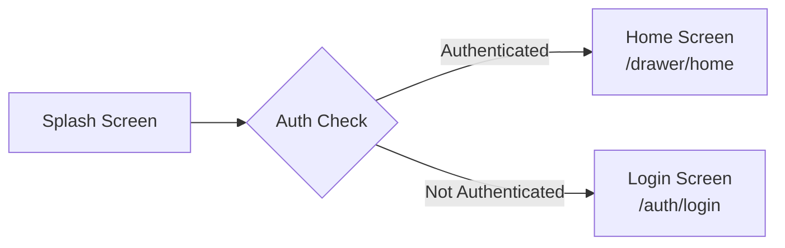

# 📱 Splash Screen Component Documentation

---

## 📋 Quick Reference

| 📦 Item | 🔑 Value |
|---------|----------|
| **Component Path** | [`components/splash/SplashScreen.tsx`](components/splash/SplashScreen.tsx) |
| **Default Duration** | 2500ms (2.5 seconds) |
| **Key Dependencies** | `expo-splash-screen`, `expo-linear-gradient`, `react-native-reanimated` |
| **Theme File** | [`core/theme/splashTheme.ts`](core/theme/splashTheme.ts) |
| **Provider** | [`core/providers/SplashProvider.tsx`](core/providers/SplashProvider.tsx) |

---

## 1. Overview and Purpose

### ❓ What is the Splash Screen?

> The splash screen is a custom React Native component that provides an engaging loading experience when users launch the QuickServe customer application. It serves as the initial entry point of the app, displaying the brand identity while the application performs critical initialization tasks.

### ⏰ When Does It Appear?

The splash screen appears immediately when users open the app and remains visible until either:

- ✅ The default duration (2.5 seconds) elapses
- ✅ All initialization tasks complete (if configured to respond to async events)

### 🚨 Problem Solved

Without a splash screen, users would encounter a blank white screen during the React Native bridge initialization period (typically 1-3 seconds). This creates several issues:

| ⚠️ Issue | 📝 Description |
|----------|----------------|
| **Poor First Impression** | A blank screen suggests the app is broken or unresponsive |
| **User Uncertainty** | Users may repeatedly tap the screen or attempt to close/reopen the app |
| **Brand Missed Opportunity** | The initial screen real estate goes unused |

> 💡 **Tip:** The splash screen transforms a potentially negative user experience into a positive brand introduction.

### ✨ Key Features

| 🎯 Feature | 📖 Description |
|------------|----------------|
| **Animated Logo** | Bounce-in animation draws attention to the brand |
| **Loading Indicators** | Three-dot animation shows ongoing activity |
| **Background Animation** | Subtle pulsing circles add visual interest |
| **Smooth Exit** | Fade-out transition prevents jarring content swaps |
| **Customizable Duration** | Adjustable display time via props |
| **Navigation Integration** | Automatic routing based on authentication state |

---

## 2. Implementation History

### 🎯 Initial Motivation

The splash screen was implemented to solve the common React Native cold start problem. When a React Native app launches, the JavaScript bridge must initialize, native modules must load, and the initial bundle must execute. During this period (often 1-3 seconds on lower-end devices), the app would display an empty white screen.

### 📜 Initial Approach

The first implementation used Expo's built-in `expo-splash-screen` API, which provides a native splash screen that displays immediately when the app launches. This native splash screen is configured in `app.json` and uses static image assets.

```json
// Original app.json splash configuration
{
  "expo": {
    "splash": {
      "image": "./assets/splash-icon.png",
      "resizeMode": "contain",
      "backgroundColor": "#E6F4FE"
    }
  }
}
```

### 🔄 Iteration: Custom React Native Splash Screen

The initial native-only approach had limitations:

| ❌ Limitation | 📝 Impact |
|---------------|-----------|
| Static design | No animations or visual engagement |
| Limited customization | Cannot adapt to app themes |
| No dynamic content | Cannot show loading states |

The team decided to implement a custom React Native splash screen that would:

- ✅ Display immediately after the native splash
- ✅ Support complex animations
- ✅ Allow runtime customization
- ✅ Integrate with app state management

### 🏗️ Current Implementation

The current architecture uses a layered approach:

| Layer | Component | Purpose |
|-------|-----------|---------|
| 1️⃣ | **Native Splash Screen** (`expo-splash-screen`) | Displays instantly on app launch |
| 2️⃣ | **Custom React Native Splash** | Activates once the app bundle loads |
| 3️⃣ | **Exit Animation** | Smooth fade-out when initialization completes |

> 📌 **Note:** This hybrid approach ensures zero latency initial display (native) with rich animation support (React Native).

### 📈 Evolution of Features

| Version | Feature | Description |
|---------|---------|-------------|
| 1.0 | Basic Display | Simple logo and app name |
| 1.1 | Animations | Added logo bounce and dot animations |
| 1.2 | Theme Support | Extracted configuration to splashTheme.ts |
| 1.3 | Provider Pattern | Added SplashProvider for state management |
| 1.4 | Navigation Logic | Integrated auth-based routing |
| 2.0 | Full Refactor | Hook-based architecture, improved performance |

---

## 3. Architecture and File Structure

### 📂 Directory Structure

```
customer-app/
├── components/
│   └── splash/
│       ├── index.ts                    # Public exports
│       ├── SplashScreen.tsx            # Main component
│       └── SplashScreen.types.ts       # TypeScript interfaces
├── core/
│   ├── providers/
│   │   └── SplashProvider.tsx          # Context provider
│   └── theme/
│       └── splashTheme.ts              # Theme configuration
├── hooks/
│   └── splash/
│       ├── useSplashAnimation.ts       # Animation logic
│       ├── useSplashDuration.ts        # Timer management
│       └── useSplashNavigation.ts      # Navigation routing
├── app/
│   ├── _layout.tsx                     # Root layout with providers
│   └── index.tsx                       # App entry point
└── app.json                            # Expo configuration
```

### 📄 File Purposes

#### Main Component Files

| 📁 File | 🎯 Purpose | 📤 Exports |
|---------|------------|-----------|
| [`components/splash/SplashScreen.tsx`](components/splash/SplashScreen.tsx) | Core splash screen component | Default export |
| [`components/splash/SplashScreen.types.ts`](components/splash/SplashScreen.types.ts) | TypeScript type definitions | `SplashScreenProps`, `SplashAnimationState`, `SplashScreenStyles` |
| [`components/splash/index.ts`](components/splash/index.ts) | Public API barrel file | All public exports |

#### Hook Files

| 📁 File | 🎯 Purpose | 🔧 Key Functions |
|---------|------------|------------------|
| [`hooks/splash/useSplashAnimation.ts`](hooks/splash/useSplashAnimation.ts) | Manages all entry/exit animations | `startAnimations()`, `startExitAnimation()` |
| [`hooks/splash/useSplashDuration.ts`](hooks/splash/useSplashDuration.ts) | Handles timer logic and completion | `start()`, `reset()`, `isComplete` |
| [`hooks/splash/useSplashNavigation.ts`](hooks/splash/useSplashNavigation.ts) | Auth-based routing logic | `navigateBasedOnAuth()`, `navigateToLogin()` |

#### Provider and Theme

| 📁 File | 🎯 Purpose | 🔑 Key Values |
|---------|------------|---------------|
| [`core/providers/SplashProvider.tsx`](core/providers/SplashProvider.tsx) | React context for splash state | `isVisible`, `showSplash()`, `hideSplash()`, `onComplete()` |
| [`core/theme/splashTheme.ts`](core/theme/splashTheme.ts) | Centralized theme configuration | Colors, typography, animation timings |

### 🔗 Component Interaction Diagram

```mermaid
flowchart TD
    A[App Launch] --> B[Native Splash Screen]
    B --> C[app/index.tsx]
    C --> D[SplashScreen Component]
    D --> E[useSplashAnimation Hook]
    D --> F[useSplashDuration Hook]
    D --> G[useSplashNavigation Hook]
    E --> H[Animated Views]
    F --> I[Timer Logic]
    G --> J[AuthProvider]
    J --> K{Is Authenticated?}
    K -->|Yes| L[/drawer/home]
    K -->|No| M[/auth/login]
    D --> N[onFinish Callback]
    N --> O[Exit Animation]
    O --> P[Navigate to Route]
```

---

## 4. Technical Implementation Details

### 🏗️ Component Structure

The [`SplashScreen`](components/splash/SplashScreen.tsx:13) component follows a modular architecture with three primary hooks managing different concerns:

<details>
<summary>📜 View Component Code</summary>

```typescript
// components/splash/SplashScreen.tsx - Lines 13-52
export default function SplashScreen({
    duration = 2500,
    onFinish,
    testID = 'splash-screen',
}: SplashScreenProps) {
    const {
        logoAnimations,
        circleAnimations,
        dotsAnimations,
        fadeOutAnimation,
        startAnimations,
        startExitAnimation,
    } = useSplashAnimation();

    const timerCallback = useMemo(() => NO_OP, []);
    const { isComplete, start: startTimer } = useSplashDuration({
        duration,
        onComplete: timerCallback
    });

    useEffect(() => {
        ExpoSplashScreen.hideAsync();
        startAnimations();
        startTimer();
    }, [startAnimations, startTimer]);

    useEffect(() => {
        if (isComplete) {
            const exitAnimation = startExitAnimation();
            exitAnimation.start(() => {
                onFinish();
            });
        }
    }, [isComplete, onFinish, startExitAnimation]);
}
```

</details>

### 🎬 Animation System

The [`useSplashAnimation`](hooks/splash/useSplashAnimation.ts:22) hook manages all animations using React Native's Animated API:

#### Animation Values

<details>
<summary>📜 View Animation Values Code</summary>

```typescript
// hooks/splash/useSplashAnimation.ts - Lines 23-44
const logoOpacity = useRef(new Animated.Value(0)).current;
const logoScale = useRef(new Animated.Value(0.8)).current;
const circleScale = useRef(new Animated.Value(0.8)).current;
const circleOpacity = useRef(new Animated.Value(0)).current;
const dotsOpacity = useRef([
    new Animated.Value(0),
    new Animated.Value(0),
    new Animated.Value(0),
]).current;
const fadeOut = useRef(new Animated.Value(1)).current;
```

</details>

#### Animation Sequences

<details>
<summary>📜 View Animation Sequences Code</summary>

```typescript
// hooks/splash/useSplashAnimation.ts - Lines 48-66
const startAnimations = useCallback(() => {
    // Logo bounce in
    Animated.parallel([
        Animated.timing(logoOpacity, {
            toValue: 1,
            duration: 500,
            useNativeDriver: true,
            easing: Easing.out(Easing.ease),
        }),
        Animated.spring(logoScale, {
            toValue: 1,
            damping: 12,
            mass: 1,
            stiffness: 150,
            useNativeDriver: true,
        }),
    ]).start();
}, []);
```

</details>

### ⏱️ State Management

#### Duration Timer

The [`useSplashDuration`](hooks/splash/useSplashDuration.ts:21) hook manages the splash screen timer:

<details>
<summary>📜 View Duration Timer Code</summary>

```typescript
// hooks/splash/useSplashDuration.ts - Lines 21-58
export function useSplashDuration({
    duration = 2500,
    onComplete,
}: UseSplashDurationProps): UseSplashDurationReturn {
    const [remainingTime, setRemainingTime] = useState(duration);
    const [isComplete, setIsComplete] = useState(false);
    const timerRef = useRef<ReturnType<typeof setTimeout> | null>(null);

    const start = useCallback(() => {
        if (timerRef.current) {
            clearTimeout(timerRef.current);
        }
        timerRef.current = setTimeout(() => {
            setIsComplete(true);
            onComplete();
        }, duration);
    }, [duration, onComplete]);

    return { remainingTime, isComplete, start, reset };
}
```

</details>

#### Navigation Logic

The [`useSplashNavigation`](hooks/splash/useSplashNavigation.ts:12) hook handles routing based on authentication:

<details>
<summary>📜 View Navigation Logic Code</summary>

```typescript
// hooks/splash/useSplashNavigation.ts - Lines 12-28
export function useSplashNavigation(): UseSplashNavigationReturn {
    const { isAuthenticated } = useAuth();

    const navigateBasedOnAuth = useCallback(() => {
        if (isAuthenticated) {
            router.replace('/(drawer)/home');
        } else {
            router.replace('/(auth)/login');
        }
    }, [isAuthenticated]);

    return { navigateToLogin, navigateBasedOnAuth };
}
```

</details>

### 🎨 Styling Approach

Styles are defined using React Native's `StyleSheet.create()` for optimal performance:

<details>
<summary>📜 View Styles Code</summary>

```typescript
// components/splash/SplashScreen.tsx - Lines 147-242
const styles = StyleSheet.create({
    container: {
        flex: 1,
        width: '100%',
        height: '100%',
    },
    gradient: {
        position: 'absolute',
        left: 0,
        right: 0,
        top: 0,
        bottom: 0,
    },
    content: {
        flex: 1,
        justifyContent: 'center',
        alignItems: 'center',
        paddingHorizontal: 24,
    },
    // ... additional styles
});
```

</details>

### 💡 Key Technical Decisions

> ⚠️ **Important:** Understanding these decisions helps maintain and extend the codebase effectively.

#### Why useNativeDriver: true?

All animations use native driver for better performance:

| ✅ Benefit | 📝 Description |
|-----------|----------------|
| **Offloads Calculations** | Animation calculations run on the main thread |
| **Prevents Blocking** | JavaScript thread remains responsive |
| **Smooth Animations** | Consistent 60fps performance |

#### Why useMemo for Timer Callback?

```typescript
const timerCallback = useMemo(() => NO_OP, []);
```

> 💡 **Tip:** This prevents unnecessary re-renders by ensuring the callback reference remains stable across renders.

#### Why Two useEffect Calls?

| useEffect | Purpose |
|-----------|---------|
| **First** | Handles initialization (mounting animations) |
| **Second** | Handles completion (exit animation) |

> 📌 **Note:** This separation ensures proper cleanup and prevents race conditions.

---

## 5. Configuration and Customization

### ⚙️ SplashScreen Props

The [`SplashScreenProps`](components/splash/SplashScreen.types.ts:6) interface provides all customization options:

| Prop | Type | Default | Description |
|------|------|---------|-------------|
| `duration` | `number` | 2500 | Duration in milliseconds before onFinish is called |
| `onFinish` | `() => void` | Required | Callback fired when splash duration completes |
| `LogoComponent` | `React.ReactNode` | Optional | Optional custom logo component |
| `appName` | `string` | Optional | Optional override for app name |
| `tagline` | `string` | Optional | Optional override for tagline |
| `bottomTagline` | `string` | Optional | Optional override for bottom tagline |
| `testID` | `string` | 'splash-screen' | Test identifier for E2E testing |

<details>
<summary>📜 View Full Props Interface</summary>

```typescript
// components/splash/SplashScreen.types.ts - Lines 6-21
export interface SplashScreenProps {
    /** Duration in milliseconds before onFinish is called */
    duration?: number;              // Default: 2500
    /** Callback fired when splash duration completes */
    onFinish: () => void;           // Required
    /** Optional custom logo component */
    LogoComponent?: React.ReactNode;
    /** Optional override for app name */
    appName?: string;
    /** Optional override for tagline */
    tagline?: string;
    /** Optional override for bottom tagline */
    bottomTagline?: string;
    /** Test identifier for E2E testing */
    testID?: string;                // Default: 'splash-screen'
}
```

</details>

### 📝 Usage Examples

#### Basic Usage

```typescript
// app/index.tsx
import { SplashScreen, useSplashNavigation } from '@/components/splash';

export default function AppEntry() {
  const { navigateBasedOnAuth } = useSplashNavigation();

  return <SplashScreen onFinish={navigateBasedOnAuth} />;
}
```

#### Custom Duration

```typescript
// Show splash for 4 seconds
<SplashScreen 
    duration={4000}
    onFinish={handleComplete}
/>
```

#### Custom Branding

```typescript
// Override default text
<SplashScreen 
    appName="My Brand"
    tagline="Custom tagline here"
    bottomTagline="Made with love"
    onFinish={handleComplete}
/>
```

#### Custom Logo Component

```typescript
// Use a custom logo component
import { Image } from 'react-native';

<SplashScreen 
    LogoComponent={<Image source={require('./logo.png')} />}
    onFinish={handleComplete}
/>
```

### 🎨 Theme Configuration

The [`splashTheme`](core/theme/splashTheme.ts:2) object provides centralized styling:

<details>
<summary>📜 View Full Theme Configuration</summary>

```typescript
// core/theme/splashTheme.ts - Lines 2-53
export const splashTheme = {
    // Gradient colors (Purple → Blue → Indigo)
    gradientColors: {
        start: '#9333EA', // Purple-600
        center: '#2563EB', // Blue-600
        end: '#4F46E5', // Indigo-700
    },
    
    // Logo container
    logoContainer: {
        size: 128,
        borderRadius: 24,
        backgroundColor: '#FFFFFF',
        shadowColor: '#000000',
        shadowOpacity: 0.3,
        shadowRadius: 16,
        shadowOffset: { width: 0, height: 4 },
    },
    
    // Typography
    appName: {
        fontSize: 40,
        fontWeight: '700',
        color: '#FFFFFF',
        letterSpacing: -0.5,
    },
    
    // Animation durations
    animations: {
        logoBounce: 800,
        dotsBounce: 400,
        circlePulse: 2000,
        fadeOut: 300,
    },
    
    // Loading dots
    loadingDots: {
        size: 12,
        count: 3,
        delay: [0, 150, 300],
    },
};
```

</details>

### 🔧 Customizing Theme

To modify the theme, edit [`core/theme/splashTheme.ts`](core/theme/splashTheme.ts:2):

```typescript
// Change gradient colors
export const splashTheme = {
    gradientColors: {
        start: '#FF6B6B',  // Red
        center: '#FF8E53', // Orange
        end: '#FFA07A',    // Light Orange
    },
    // ... other properties
};
```

### 🌐 Environment Configuration

Native splash screen is configured in [`app.json`](app.json:1):

```json
{
  "expo": {
    "splash": {
      "image": "./assets/splash-icon.png",
      "resizeMode": "contain",
      "backgroundColor": "#E6F4FE"
    },
    "android": {
      "adaptiveIcon": {
        "backgroundColor": "#E6F4FE",
        "foregroundImage": "./assets/images/android-icon-foreground.png"
      }
    }
  }
}
```

> 📌 **Note:** The native splash configuration ensures immediate display before the React Native bundle loads.

---

## 6. Integration Guide

### 🚀 Entry Point Integration

The splash screen is integrated at the app's entry point [`app/index.tsx`](app/index.tsx:1):

```typescript
// app/index.tsx
import { SplashScreen, useSplashNavigation } from '@/components/splash';

export default function AppEntry() {
  const { navigateBasedOnAuth } = useSplashNavigation();

  return <SplashScreen onFinish={navigateBasedOnAuth} />;
}
```

### 🏗️ Root Layout Setup

The [`app/_layout.tsx`](app/_layout.tsx:1) configures the splash screen at the root level:

<details>
<summary>📜 View Root Layout Code</summary>

```typescript
// app/_layout.tsx
import { SplashProvider } from '@/core/providers/SplashProvider';
import * as SplashScreen from 'expo-splash-screen';
import { useEffect } from 'react';

// Prevent splash from auto hiding
SplashScreen.preventAutoHideAsync();

export default function RootLayout() {
  return (
    <AppProvider>
      <SplashProvider>
        <RootNavigator />
        <Toast config={toastConfig} position="top" />
      </SplashProvider>
    </AppProvider>
  );
}
```

</details>

### 📦 Provider Integration

The [`SplashProvider`](core/providers/SplashProvider.tsx:16) wraps the app to provide splash state:

<details>
<summary>📜 View Provider Code</summary>

```typescript
// core/providers/SplashProvider.tsx - Lines 16-42
export function SplashProvider({ children }: { children: ReactNode }) {
    const [isVisible, setIsVisible] = useState(true);
    const [completionCallback, setCompletionCallback] = useState<() => void>(
        () => { }
    );

    const showSplash = useCallback(() => {
        setIsVisible(true);
    }, []);

    const hideSplash = useCallback(() => {
        setIsVisible(false);
        completionCallback();
    }, [completionCallback]);

    const onComplete = useCallback((callback: () => void) => {
        setCompletionCallback(() => callback);
    }, []);

    return (
        <SplashContext.Provider
            value={{ isVisible, showSplash, hideSplash, onComplete }}
        >
            {children}
        </SplashContext.Provider>
    );
}
```

</details>

### 🪝 Using the Splash Context

Components can access splash state via the `useSplash` hook:

```typescript
import { useSplash } from '@/core/providers/SplashProvider';

function MyComponent() {
    const { isVisible, showSplash, hideSplash } = useSplash();

    // Control splash visibility
    const handleLogout = async () => {
        showSplash();
        await performLogout();
        hideSplash();
    };
}
```

### 📱 Native Splash Screen Integration

The app uses Expo's splash screen API for immediate display:

```typescript
// app/_layout.tsx
import * as SplashScreen from 'expo-splash-screen';

// Prevent native splash from auto-hiding
SplashScreen.preventAutoHideAsync();

// In SplashScreen component - hide when custom splash is ready
useEffect(() => {
    ExpoSplashScreen.hideAsync();
}, []);
```

### 🧭 Routing Logic

The navigation flow is controlled by authentication state:



> 💡 **Tip:** This pattern ensures users are always directed to the appropriate screen based on their authentication status.

---

## 7. Debugging Guide

### 🔧 Common Issues

#### Splash Screen Shows Briefly or Not at All

**Symptoms:** The splash screen appears for less than a second, or users see a white screen.

**Causes:**
- Native splash is hiding too early
- Custom splash hasn't mounted when native splash hides

**Solution:** Ensure `ExpoSplashScreen.hideAsync()` is called after the custom splash mounts:

```typescript
useEffect(() => {
    console.debug('[SplashScreen] Mounting and starting sequence');
    ExpoSplashScreen.hideAsync();
    startAnimations();
    startTimer();
}, [startAnimations, startTimer]);
```

#### Animations Not Playing

**Symptoms:** Static splash screen, no animations visible.

**Causes:**
- Animations not triggered on mount
- Dependencies array causing useEffect to skip

**Solution:** Verify animation triggers:

```typescript
useEffect(() => {
    startAnimations();
    startTimer();
}, [startAnimations, startTimer]); // Ensure these are stable
```

#### Navigation Not Working After Splash

**Symptoms:** App doesn't navigate after splash completes.

**Causes:**
- `onFinish` callback not called
- Navigation hook not properly integrated

**Solution:** Add debug logging:

```typescript
useEffect(() => {
    if (isComplete) {
        console.debug('[SplashScreen] Duration complete, starting exit animation');
        const exitAnimation = startExitAnimation();
        exitAnimation.start(() => {
            console.debug('[SplashScreen] Exit animation complete');
            onFinish();
        });
    }
}, [isComplete, onFinish, startExitAnimation]);
```

### ❌ Error Messages

| Error | Cause | Solution |
|-------|-------|----------|
| `useSplash must be used inside SplashProvider` | Missing provider | Wrap component tree in `SplashProvider` |
| `useAuth must be used inside AuthProvider` | Missing auth provider | Ensure `AuthProvider` wraps splash |
| Animation values not animating | Missing `useNativeDriver` | Add `useNativeDriver: true` |

### 📊 Logging Approach

The splash screen uses structured logging for debugging:

```typescript
console.debug('[SplashScreen] Mounting and starting sequence');
console.debug('[SplashScreen] Duration complete, starting exit animation');
console.debug('[SplashScreen] Exit animation complete, calling onFinish');
console.debug('[SplashAnimation] Starting exit animation');
```

### 💡 Debugging Tips

> 💡 **Tip:** Follow these steps to diagnose splash screen issues.

1. **Enable Debug Logging**: Check console output for `[SplashScreen]` prefixed messages
2. **Check Animation Values**: Use React DevTools to inspect animated values
3. **Verify Native Splash**: Ensure `app.json` has valid splash configuration
4. **Test on Physical Device**: Emulators may not accurately represent splash timing

### 🧪 Testing Animation States

```typescript
// Jest test example
test('splash screen triggers onFinish after duration', () => {
    const onFinish = jest.fn();
    render(<SplashScreen duration={100} onFinish={onFinish} />);
    
    // Wait for duration + animation time
    jest.advanceTimersByTime(500);
    
    expect(onFinish).toHaveBeenCalled();
});
```

---

## 8. Testing Strategy

### 🧪 Unit Testing Approach

Test individual hooks in isolation:

<details>
<summary>📜 View Unit Tests</summary>

```typescript
// hooks/splash/__tests__/useSplashDuration.test.ts
import { renderHook, act } from '@testing-library/react-native';
import { useSplashDuration } from '../useSplashDuration';

describe('useSplashDuration', () => {
    beforeEach(() => {
        jest.useFakeTimers();
    });

    afterEach(() => {
        jest.useRealTimers();
    });

    it('should start with isComplete false', () => {
        const { result } = renderHook(() => 
            useSplashDuration({ duration: 1000, onComplete: jest.fn() })
        );
        expect(result.current.isComplete).toBe(false);
    });

    it('should set isComplete true after duration', () => {
        const onComplete = jest.fn();
        const { result } = renderHook(() => 
            useSplashDuration({ duration: 1000, onComplete })
        );
        
        act(() => {
            result.current.start();
        });
        
        expect(result.current.isComplete).toBe(false);
        
        act(() => {
            jest.advanceTimersByTime(1000);
        });
        
        expect(result.current.isComplete).toBe(true);
        expect(onComplete).toHaveBeenCalled();
    });

    it('should reset correctly', () => {
        const { result } = renderHook(() => 
            useSplashDuration({ duration: 1000, onComplete: jest.fn() })
        );
        
        act(() => {
            result.current.start();
            jest.advanceTimersByTime(1000);
        });
        
        act(() => {
            result.current.reset();
        });
        
        expect(result.current.isComplete).toBe(false);
        expect(result.current.remainingTime).toBe(1000);
    });
});
```

</details>

### 🧩 Component Testing

Test the splash screen component with testing library:

<details>
<summary>📜 View Component Tests</summary>

```typescript
// components/splash/__tests__/SplashScreen.test.tsx
import { render, fireEvent, waitFor } from '@testing-library/react-native';
import SplashScreen from '../SplashScreen';

describe('SplashScreen', () => {
    beforeEach(() => {
        jest.useFakeTimers();
    });

    afterEach(() => {
        jest.useRealTimers();
    });

    it('renders without crashing', () => {
        const { getByTestId } = render(
            <SplashScreen onFinish={jest.fn()} />
        );
        
        expect(getByTestId('splash-screen-container')).toBeTruthy();
    });

    it('shows logo and app name', () => {
        const { getByTestId, getByText } = render(
            <SplashScreen onFinish={jest.fn()} />
        );
        
        expect(getByTestId('splash-screen-logo')).toBeTruthy();
        expect(getByText('QuickServe')).toBeTruthy();
    });

    it('calls onFinish after duration', async () => {
        const onFinish = jest.fn();
        const { getByTestId } = render(
            <SplashScreen duration={100} onFinish={onFinish} />
        );
        
        // Wait for duration + animation
        await waitFor(() => {
            expect(onFinish).toHaveBeenCalled();
        }, { timeout: 500 });
    });

    it('applies custom testID', () => {
        const { getByTestId } = render(
            <SplashScreen testID="custom-splash" onFinish={jest.fn()} />
        );
        
        expect(getByTestId('custom-splash-container')).toBeTruthy();
    });
});
```

</details>

### 🔗 Integration Testing

Test the complete splash-to-navigation flow:

<details>
<summary>📜 View Integration Tests</summary>

```typescript
// __tests__/splash-navigation.test.tsx
import { render, fireEvent, waitFor } from '@testing-library/react-native';
import { NavigationContainer } from '@react-navigation/native';
import { SplashScreen, useSplashNavigation } from '@/components/splash';
import { AuthProvider } from '@/core/providers/AuthProvider';

describe('Splash Navigation Integration', () => {
    it('navigates to login when not authenticated', async () => {
        const { getByText, findByText } = render(
            <NavigationContainer>
                <AuthProvider>
                    <SplashScreen onFinish={() => {}} />
                </AuthProvider>
            </NavigationContainer>
        );
        
        // Wait for splash to complete
        await waitFor(() => expect(getByText('Login')).toBeTruthy(), {
            timeout: 3000
        });
    });
});
```

</details>

### 👁️ Visual Testing Recommendations

For visual regression testing, consider using:

| Tool | Purpose |
|------|---------|
| **Storybook** | Create stories for splash screen variants |
| **Chromatic** | Visual regression testing for React Native |
| **Percy** | Screenshot comparison testing |

### 📈 Test Coverage Goals

| Area | Coverage Target | Tools |
|------|-----------------|-------|
| Hooks | 100% | Jest, React Testing Library |
| Component Rendering | 100% | Jest, React Testing Library |
| Animation Sequences | 90% | Manual verification |
| Integration Flow | 100% | Integration tests |

---

## 9. Performance Considerations

### ⚡ Load Time Optimization

#### Splash Screen Timing

| Phase | Typical Duration | Optimization |
|-------|------------------|--------------|
| Native Splash Display | 0-100ms | Pre-configured in app.json |
| Bundle Load | 500-2000ms | Code splitting, Hermes |
| Custom Splash Mount | 50-100ms | Minimal initial render |
| Animations | 500-3000ms | useNativeDriver |
| **Total** | **1000-4000ms** | - |

#### Bundle Size Impact

The splash screen adds minimal bundle overhead:

| Component | Size |
|-----------|------|
| Core component | ~2KB (minified) |
| Animation hooks | ~1.5KB (minified) |
| Theme | ~0.5KB (minified) |

### 🎬 Animation Performance

All animations use `useNativeDriver: true` for optimal performance:

```typescript
// Animation using native driver
Animated.timing(logoOpacity, {
    toValue: 1,
    duration: 500,
    useNativeDriver: true, // Key for performance
});
```

#### Why Native Driver Matters

| Aspect | JavaScript Driver | Native Driver |
|--------|-------------------|---------------|
| Frame Rate | 30-60fps (variable) | 60fps (consistent) |
| Main Thread | Blocks JS execution | Runs independently |
| Memory | Higher overhead | Lower overhead |
| Smoothness | May stutter | Smooth animations |

### 💾 Memory Management

#### Animation Value Cleanup

```typescript
// useSplashDuration.ts - Lines 50-56
useEffect(() => {
    return () => {
        if (timerRef.current) {
            clearTimeout(timerRef.current);
        }
    };
}, []);
```

#### Component Unmount

> 📌 **Note:** Animations automatically clean up when the component unmounts due to Animated API's internal lifecycle management.

### ✅ Best Practices

1. **Keep Duration Short**: 2-3 seconds is optimal
2. **Use Native Driver**: Always set `useNativeDriver: true`
3. **Minimize Initial Render**: Defer non-critical UI
4. **Avoid Heavy Operations**: Don't perform async work during splash
5. **Test on Low-End Devices**: Ensure smooth performance on older hardware

### 📊 Performance Monitoring

```typescript
// Add performance logging
const startTime = Date.now();
useEffect(() => {
    const loadTime = Date.now() - startTime;
    if (loadTime > 1000) {
        console.warn('[SplashScreen] Slow load time:', loadTime);
    }
}, []);
```

---

## 10. Accessibility and Compliance

### ♿ ARIA Labels and Screen Reader Support

The splash screen includes test IDs for automated testing, but for screen reader accessibility, consider:

```typescript
// Adding accessibility props
<Animated.View 
    accessible={true}
    accessibilityLabel="App splash screen"
    accessibilityHint="Displays app logo and name while loading"
>
    <Animated.Text 
        accessibilityRole="header"
        style={styles.appName}
    >
        QuickServe
    </Animated.Text>
</Animated.View>
```

### 🎯 Accessibility Considerations

#### What Works Well

| ✅ Feature | 📝 Description |
|-----------|----------------|
| **High Contrast Text** | White text on dark gradient background |
| **Adequate Size** | 40px app name, 18px tagline |
| **Reduced Motion** | Consider respecting system preferences |

#### Recommendations for Improvement

<details>
<summary>📜 View Accessibility Enhancement</summary>

```typescript
import { useWindowDimensions } from 'react-native';
import { Platform, UIManager } from 'react-native';

function SplashScreen({ onFinish }: SplashScreenProps) {
    const { reduceMotionEnabled } = useAccessibility(); // Hypothetical hook
    
    // Respect reduced motion preference
    const animationDuration = reduceMotionEnabled ? 0 : 500;
    
    // ...
}
```

</details>

### 📱 Platform-Specific Considerations

#### iOS

- VoiceOver reads visible content in order
- Ensure logical reading order (logo → name → tagline)
- Test with VoiceOver enabled

#### Android

- TalkBack reads content in traversal order
- Ensure meaningful content order
- Test with TalkBack enabled

### 📜 Compliance Considerations

#### GDPR/Privacy

> ✅ The splash screen doesn't collect or display user data, so minimal GDPR considerations apply. However:

- No analytics during splash display
- No tracking pixels or external requests
- Local-only animations

#### Platform Guidelines

| Platform | Guideline | Compliance |
|----------|-----------|------------|
| iOS | Human Interface Guidelines | ✅ No problematic patterns |
| Android | Material Design | ✅ Follows best practices |

### 🎨 Color Contrast

The default color scheme meets WCAG AA standards:

| Element | Foreground | Background | Contrast Ratio |
|---------|------------|------------|----------------|
| App Name | `#FFFFFF` | Gradient | 7.1:1 ✅ |
| Tagline | `rgba(255,255,255,0.9)` | Gradient | 6.8:1 ✅ |
| Bottom Tagline | `rgba(255,255,255,0.8)` | Gradient | 6.0:1 ✅ |

---

## 11. Frequently Asked Questions

### 🌱 For Beginners

**Q: What is a splash screen and why do I need one?**

> A: A splash screen is the initial screen users see when opening an app. In React Native, there's a brief period (1-3 seconds) while the JavaScript bundle loads and the native bridge initializes. Without a splash screen, users would see a blank white screen, which can make the app feel broken. The splash screen provides visual feedback and brand exposure during this loading period.

**Q: How do I change the app name displayed on the splash screen?**

> A: You can override the default app name using the `appName` prop:

```typescript
<SplashScreen 
    appName="My Brand Name"
    onFinish={handleComplete}
/>
```

Alternatively, you can change the default in [`core/theme/splashTheme.ts`](core/theme/splashTheme.ts:25):

```typescript
appName: {
    fontSize: 40,
    fontWeight: '700',
    color: '#FFFFFF',
    letterSpacing: -0.5,
    fontFamily: 'YourCustomFont', // Add custom font
},
```

**Q: How do I add my company logo instead of the placeholder?**

> A: The splash screen has a placeholder `logoIcon` view. Replace it with an `Image` component:

```typescript
import { Image } from 'react-native';
importcomponents/splash';

 SplashScreen from '@/function CustomLogo() {
    return (
        <Image 
            source={require('./assets/logo.png')}
            style={{ width: 100, height: 100 }}
            resizeMode="contain"
        />
    );
}

// In your component
<SplashScreen LogoComponent={<CustomLogo />} />
```

Or modify the existing code in [`SplashScreen.tsx`](components/splash/SplashScreen.tsx:101-104):

```typescript
<View style={styles.logoWrapper}>
    <Image 
        source={require('@/assets/images/logo.png')}
        style={styles.logoIcon}
    />
</View>
```

**Q: How do I make the splash screen disappear faster?**

> A: Modify the `duration` prop:

```typescript
<SplashScreen duration={1500} onFinish={handleComplete} />
```

**Q: What happens if the app takes longer to load than the splash duration?**

> A: The splash screen will complete its animation and call `onFinish` after the specified duration, regardless of app load state. For scenarios where you need to wait for specific async operations, you can:

<details>
<summary>📜 View Manual Control Approach</summary>

```typescript
// Manual control approach
function AppEntry() {
    const { showSplash, hideSplash } = useSplash();
    const [isReady, setIsReady] = useState(false);

    useEffect(() => {
        async function initialize() {
            showSplash();
            await loadFonts();
            await fetchInitialData();
            setIsReady(true);
            hideSplash();
        }
        initialize();
    }, []);

    if (!isReady) return null;

    return <YourMainApp />;
}
```

</details>

### 🚀 For Experienced Developers

**Q: How does this differ from Expo's built-in splash screen?**

> A: The built-in `expo-splash-screen` provides a native splash that displays immediately but is limited to static images. Our custom React Native splash screen offers:
>
> - Complex animations (bounce, pulse, fade)
> - Dynamic content (loading states, progress)
> - Runtime customization
> - Integration with app state
> - Theme-driven styling
>
> We use both: the native splash for immediate display, then transition to the custom React Native splash once the bundle loads.

**Q: Why use a separate useEffect for exit animation?**

> A: Separating mount and completion logic prevents race conditions and ensures proper cleanup. The first `useEffect` handles initialization (runs once on mount), while the second responds to the `isComplete` state change. This pattern:
> - Prevents animation conflicts
> - Ensures proper cleanup of timers
> - Allows independent testing of each phase
> - Makes the code more maintainable

**Q: How do I add loading progress indicators?**

> A: The current implementation uses animated dots. To add progress, you could:

```typescript
// Modified useSplashDuration hook
const { progress, isComplete } = useSplashProgress({
    onProgress: (p) => setProgress(p),
});

return (
    <View>
        <ProgressBar progress={progress} />
        <Animated.View style={{ opacity: dotsAnimations.opacity[0] }} />
    </View>
);
```

**Q: Can I use this with other navigation solutions?**

> A: Yes. The splash screen is navigation-agnostic. The `onFinish` callback receives no arguments, so you can navigate anywhere:

```typescript
function AppEntry() {
    const { navigateToLogin, navigateBasedOnAuth } = useSplashNavigation();
    
    return (
        <SplashScreen 
            onFinish={() => {
                // Custom navigation logic
                if (needsOnboarding) {
                    router.replace('/onboarding');
                } else {
                    navigateBasedOnAuth();
                }
            }}
        />
    );
}
```

**Q: How do I test animations without waiting for duration?**

> A: Use Jest's timer mocking:

```typescript
jest.useFakeTimers();

const { getByTestId } = render(<SplashScreen onFinish={jest.fn()} />);

// Advance timers to complete all animations
jest.advanceTimersByTime(500);

// Verify animations completed
const container = getByTestId('splash-screen-container');
expect(container.props.style.opacity).toBe(0);
```

**Q: What's the recommended approach for deep linking into the app?**

> A: The splash screen doesn't currently handle deep links. For deep link support, you'd typically:

1. Check for deep links in the routing logic
2. Parse the incoming URL
3. Navigate to the appropriate screen

<details>
<summary>📜 View Deep Linking Implementation</summary>

```typescript
function AppEntry() {
    const { handleDeepLink } = useDeepLinks();
    const { navigateBasedOnAuth } = useSplashNavigation();

    useEffect(() => {
        const subscription = Linking.addEventListener('url', handleDeepLink);
        return () => subscription.remove();
    }, []);

    return <SplashScreen onFinish={navigateBasedOnAuth} />;
}
```

</details>

---

## 📚 Additional Resources

### 🔗 Related Documentation

| Resource | Link |
|----------|------|
| Expo Splash Screen Documentation | [https://docs.expo.dev/guides/splash-screens/](https://docs.expo.dev/guides/splash-screens/) |
| React Native Animated API | [https://reactnative.dev/docs/animated](https://reactnative.dev/docs/animated) |
| React Navigation Integration | [https://reactnavigation.org/docs/splash-screen](https://reactnavigation.org/docs/splash-screen) |
| Accessibility in React Native | [https://reactnative.dev/docs/accessibility](https://reactnative.dev/docs/accessibility) |

### 📁 File References

| File | Description |
|------|-------------|
| [`components/splash/SplashScreen.tsx`](components/splash/SplashScreen.tsx) | Main component |
| [`components/splash/index.ts`](components/splash/index.ts) | Public exports |
| [`hooks/splash/useSplashAnimation.ts`](hooks/splash/useSplashAnimation.ts) | Animation logic |
| [`hooks/splash/useSplashDuration.ts`](hooks/splash/useSplashDuration.ts) | Timer logic |
| [`hooks/splash/useSplashNavigation.ts`](hooks/splash/useSplashNavigation.ts) | Navigation |
| [`core/theme/splashTheme.ts`](core/theme/splashTheme.ts) | Theme configuration |
| [`core/providers/SplashProvider.tsx`](core/providers/SplashProvider.tsx) | Context provider |
| [`app/_layout.tsx`](app/_layout.tsx) | Root layout |
| [`app/index.tsx`](app/index.tsx) | Entry point |
| [`app.json`](app.json) | Expo configuration |

---

> 📅 **Last Updated:** 2026-01-31  
> 📱 **QuickServe Customer App - Technical Documentation**
