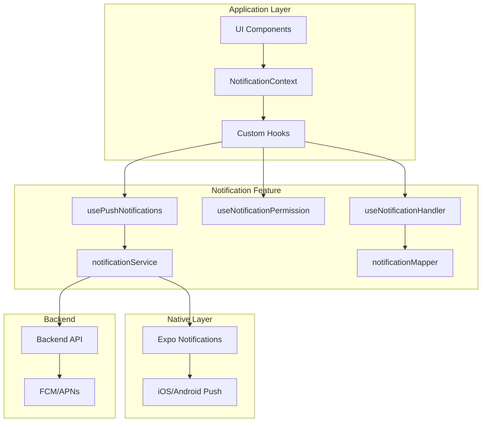
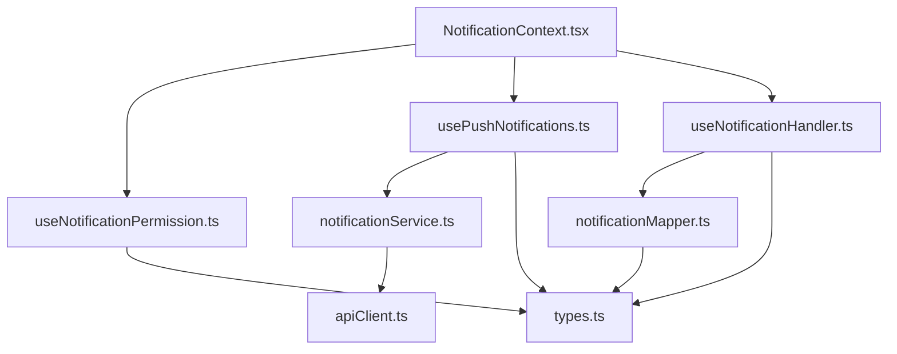
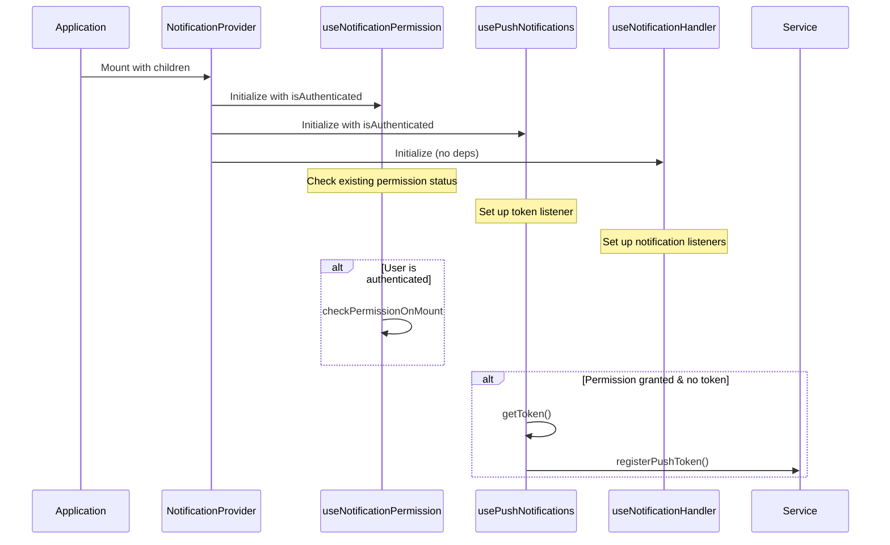
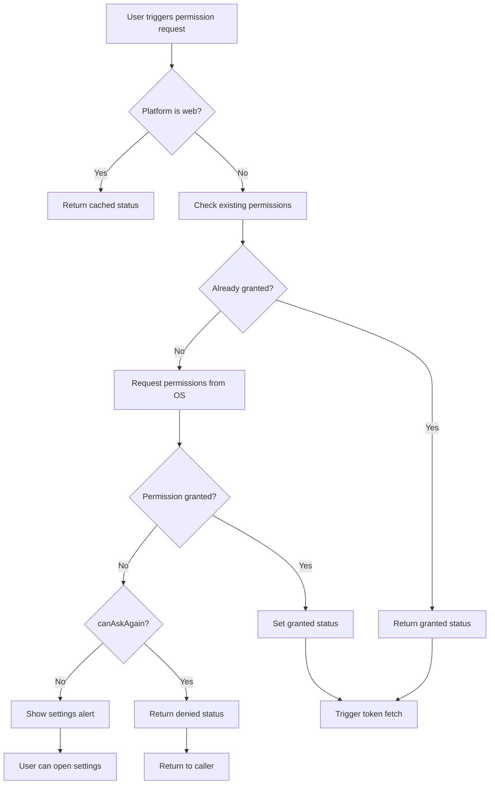
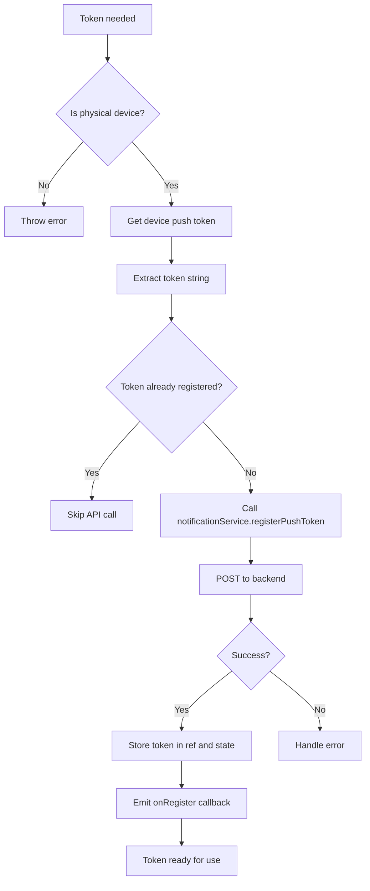
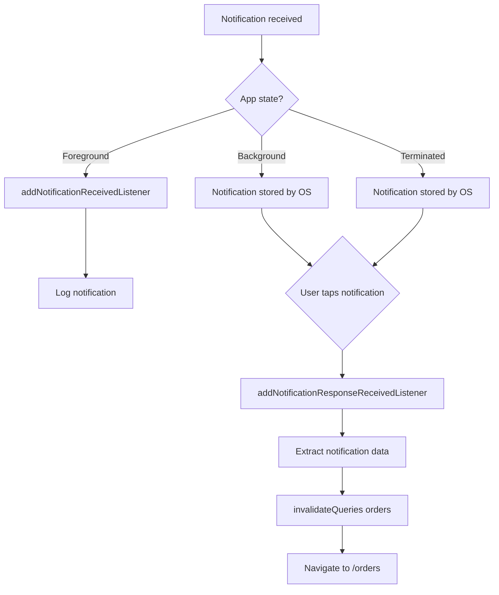
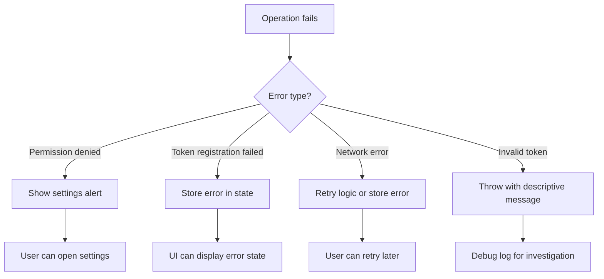

# Notification System Technical Documentation

## Table of Contents

1. [System Overview](#1-system-overview)
2. [Architecture & Directory Structure](#2-architecture--directory-structure)
3. [Entry Points & Initialization](#3-entry-points--initialization)
4. [Core Components & Modules](#4-core-components--modules)
5. [End-to-End Flow Diagrams](#5-end-to-end-flow-diagrams)
6. [Code Commenting Standards](#6-code-commenting-standards)
7. [Testing Guide](#7-testing-guide)
8. [Debugging & Troubleshooting](#8-debugging--troubleshooting)
9. [Extension & Feature Development](#9-extension--feature-development)
10. [API Reference](#10-api-reference)

---

## 1. System Overview

The notification system is a comprehensive push notification infrastructure that enables the application to receive and handle push notifications from a backend server. It provides real-time updates to users about their order status, delivery progress, and other important application events.

### Key Responsibilities

- **Permission Management**: Requests and manages OS-level notification permissions across iOS, Android, and web platforms
- **Token Lifecycle**: Handles push token generation, storage, and backend registration with deduplication
- **Notification Handling**: Processes incoming notifications when the app is in foreground, background, or terminated state
- **User Navigation**: Automatically navigates users to relevant screens when they tap on notifications
- **State Management**: Provides a global React Context for notification state access throughout the application

### Purpose in Application Architecture

The notification system integrates with the application's authentication flow and operates as a cross-cutting concern. It sits between the native push notification infrastructure (via Expo Notifications) and the application's business logic, providing a clean abstraction layer for all notification-related operations.



---

## 2. Architecture & Directory Structure

```
features/notifications/
├── types.ts                                    # TypeScript type definitions
├── context/
│   └── NotificationContext.tsx                 # React Context provider orchestrator
├── hooks/
│   ├── useNotificationHandler.ts               # Foreground/background notification handling
│   ├── useNotificationPermission.ts            # OS permission request/management
│   └── usePushNotifications.ts                 # Push token lifecycle & registration
├── services/
│   └── notificationService.ts                  # Backend API service for token registration
├── utils/
│   └── notificationMapper.ts                   # Payload validation & parsing utilities
└── NOTIFICATIONS_DOCUMENTATION.md              # This documentation file
```

### File Relationships



---

## 3. Entry Points & Initialization

### 3.1 App Integration

The notification system is integrated into the application through the [`NotificationProvider`](features/notifications/context/NotificationContext.tsx:37) component. This provider must be placed in the component tree above any components that need access to notification state.

```tsx
// app/_layout.tsx or your main layout file
import { NotificationProvider } from '@/features/notifications/context/NotificationContext';
import { useAuth } from '@/core/providers/AuthProvider';

export default function RootLayout() {
  return (
    <AuthProvider>
      <NotificationProvider>
        {/* Your app content */}
      </NotificationProvider>
    </AuthProvider>
  );
}
```

### 3.2 Initialization Sequence

The initialization follows a specific sequence to ensure proper setup:



### 3.3 Platform-Specific Setup Requirements

#### iOS
- Requires `UIBackgroundModes` configuration in `app.json`:
  ```json
  {
    "ios": {
      "supportsTablet": true,
      "bundleIdentifier": "com.yourapp.app",
      "infoPlist": {
        "UIBackgroundModes": ["fetch", "remote-notification"]
      }
    }
  }
  ```

#### Android
- Requires `google-services.json` or Firebase configuration
- Expo automatically handles FCM integration when properly configured

#### Web
- Push notifications are not supported on web platform
- All hooks gracefully skip operations and return safe defaults
- See [`useNotificationPermission.ts`](features/notifications/hooks/useNotificationPermission.ts:22) for web handling

---

## 4. Core Components & Modules

### 4.1 types.ts

**File Overview**: Centralized TypeScript type definitions for the notification system.

**Public API**:

| Type/Interface | Description |
|----------------|-------------|
| [`NotificationType`](features/notifications/types.ts:1) | Union type of valid notification types: `order_confirmed`, `order_processing`, `order_out_for_delivery`, `order_delivered`, `order_cancelled` |
| [`PushToken`](features/notifications/types.ts:8) | Interface representing a registered push token with metadata |
| [`NotificationRoute`](features/notifications/types.ts:17) | Interface for notification navigation targets |
| [`NotificationPermissionStatus`](features/notifications/types.ts:22) | Interface representing the current permission status |

**Dependencies**: None (pure type definitions)

---

### 4.2 NotificationContext.tsx

**File Overview**: React Context provider that orchestrates the entire notification system. Acts as the central integration point for all notification-related functionality.

**Public API**:

```tsx
// Context interface
interface NotificationContextType {
  isEnabled: boolean;        // Whether notifications are enabled
  isLoading: boolean;        // Whether token registration is in progress
  token: string | null;      // Current push token
  requestPermission: () =>   // Function to request permissions
    Promise<boolean>;
}

// Hook to consume context
export function useNotifications(): NotificationContextType;
```

**Internal Implementation**:

| Component/Function | Purpose |
|-------------------|---------|
| [`setNotificationHandler`](features/notifications/context/NotificationContext.tsx:16) | Global configuration for foreground notification behavior (sound, vibration, banner display) |
| [`triggerTokenFetch`](features/notifications/context/NotificationContext.tsx:63) | Automatic token fetching when notifications are enabled and user is authenticated |
| [`handleRequestPermission`](features/notifications/context/NotificationContext.tsx:87) | Permission request handler with settings alert fallback |

**Dependencies**:
- `react` - React hooks and context
- `expo-notifications` - Native notification handling
- `AuthProvider` - Authentication state
- Custom hooks: `useNotificationPermission`, `usePushNotifications`, `useNotificationHandler`

---

### 4.3 useNotificationPermission.ts

**File Overview**: Manages OS-level notification permission requests and status checks. Handles platform differences and provides a unified interface.

**Public API**:

```typescript
interface UseNotificationPermissionReturn {
  permissionStatus: NotificationPermissionStatus;
  requestPermission: () => Promise<NotificationPermissionStatus>;
  checkPermission: () => Promise<NotificationPermissionStatus>;
}
```

**Internal Implementation**:

| Function | Purpose |
|----------|---------|
| [`requestPermission`](features/notifications/hooks/useNotificationPermission.ts:20) | Requests notification permission from the OS; returns cached status on web |
| [`checkPermission`](features/notifications/hooks/useNotificationPermission.ts:49) | Checks current permission status without requesting |
| [`checkPermissionOnMount`](features/notifications/hooks/useNotificationPermission.ts:74) | Initial permission check when user authenticates |

**Dependencies**:
- `react` - Hooks
- `react-native` - Platform detection
- `expo-notifications` - Native permission APIs

---

### 4.4 usePushNotifications.ts

**File Overview**: Handles the complete lifecycle of push tokens including generation, extraction, and backend registration. Implements deduplication to prevent redundant API calls.

**Public API**:

```typescript
interface UsePushNotificationsReturn {
  pushToken: string | null;      // Current push token
  error: Error | null;           // Any registration errors
  isLoading: boolean;            // Whether registration is in progress
  getToken: () => Promise<string | null>;  // Force token refresh
  registerToken: (token: string) => Promise<void>;  // Manual registration
}
```

**Internal Implementation**:

| Function/Component | Purpose |
|-------------------|---------|
| [`handleRegistrationError`](features/notifications/hooks/usePushNotifications.ts:26) | Centralized error handler for registration failures |
| [`handleTokenRegistration`](features/notifications/hooks/usePushNotifications.ts:38) | Registers token with backend; prevents duplicate registrations |
| [`getToken`](features/notifications/hooks/usePushNotifications.ts:111) | Generates new push token from device |
| [`addPushTokenListener`](features/notifications/hooks/usePushNotifications.ts:83) | Listens for token refresh events |

**Token Deduplication Logic**:

```typescript
// Uses registeredTokenRef to prevent redundant API calls
if (registeredTokenRef.current === token) {
  console.log('[usePushNotifications] Token already registered, skipping API call');
  return;
}
```

**Dependencies**:
- `react` - Hooks and refs
- `react-native` - Platform and device info
- `expo-device` - Device information
- `expo-notifications` - Push token APIs
- `notificationService` - Backend registration

---

### 4.5 useNotificationHandler.ts

**File Overview**: Handles notification reception and user interaction when the app is in various states (foreground, background, terminated). Manages navigation responses to notification taps.

**Public API**: This hook has no direct public exports; it operates as a side-effect handler.

**Internal Implementation**:

| Function/Component | Purpose |
|-------------------|---------|
| [`handleNotification`](features/notifications/hooks/useNotificationHandler.ts:9) | Processes notification tap events; invalidates queries and navigates |
| [`addNotificationReceivedListener`](features/notifications/hooks/useNotificationHandler.ts:28) | Handles notifications received while app is in foreground |
| [`addNotificationResponseReceivedListener`](features/notifications/hooks/useNotificationHandler.ts:40) | Handles user tap interactions on notifications |
| [`getLastNotificationResponseAsync`](features/notifications/hooks/useNotificationHandler.ts:50) | Handles notifications that triggered app launch |

**Dependencies**:
- `react` - Hooks
- `expo-router` - Navigation
- `expo-notifications` - Notification event listeners
- `@tanstack/react-query` - Query invalidation for data refresh

---

### 4.6 notificationService.ts

**File Overview**: API service layer for backend communication. Handles push token registration with the server.

**Public API**:

```typescript
class NotificationApiService {
  async registerPushToken(
    payload: RegisterTokenPayload
  ): Promise<PushToken>;
}

export const notificationService: NotificationApiService;
```

**Internal Implementation**:

| Function | Purpose |
|----------|---------|
| [`registerPushToken`](features/notifications/services/notificationService.ts:27) | POSTs device token to backend registration endpoint |

**Dependencies**:
- `@/core/api/client` - HTTP client
- `@/core/api/endpoints` - API endpoint definitions
- `PushToken` - Response type

---

### 4.7 notificationMapper.ts

**File Overview**: Utility module for validating and parsing notification payloads. Provides type safety for incoming notification data.

**Public API**:

```typescript
class NotificationMapper {
  isValidNotificationType(type: string): type is NotificationType;
  parsePayload(payload: any): NotificationPayload | null;
}

export const notificationMapper: NotificationMapper;
export function extractNotificationType(
  data: Record<string, unknown>
): NotificationType | null;
```

**Internal Implementation**:

| Function | Purpose |
|----------|---------|
| [`VALID_TYPES`](features/notifications/utils/notificationMapper.ts:26) | Set of valid notification type strings for O(1) validation |
| [`isValidNotificationType`](features/notifications/utils/notificationMapper.ts:38) | Type guard for notification type validation |
| [`parsePayload`](features/notifications/utils/notificationMapper.ts:45) | Parses and validates raw notification payload |

**Dependencies**:
- `NotificationType` - Type definition from types.ts

---

## 5. End-to-End Flow Diagrams

### 5.1 Permission Request Flow



### 5.2 Token Registration Flow



### 5.3 Notification Handling Flow



### 5.4 Error Scenario Handling



---

## 6. Code Commenting Standards

### 6.1 File-Level Documentation

All files should begin with a header describing the module's purpose:

```typescript
/**
 * Notification Mapper Module
 *
 * Handles validation and parsing of notification payloads.
 *
 * Following SOLID/KISS principles:
 * - Single Responsibility: Handles parsing and validation.
 * - KISS: Simple implementation with minimal complexity.
 */
```

### 6.2 Function Docstrings

Functions should include JSDoc comments with parameters and return values:

```typescript
/**
 * Registers a device push token with the backend.
 * This is necessary for the server to know where to send push notifications.
 *
 * @param payload - The device information including the token.
 * @returns A promise that resolves to the registration result.
 */
async registerPushToken(payload: RegisterTokenPayload): Promise<PushToken> {
  // implementation
}
```

### 6.3 Inline Comments

Use inline comments for complex logic or important decisions:

```typescript
// Prevent redundant registration if token hasn't changed
if (registeredTokenRef.current === token) {
  console.log('[usePushNotifications] Token already registered, skipping API call');
  return;
}
```

### 6.4 Warning Callouts

Mark edge cases and important behavior:

```typescript
// ROBUST TRIGGER: Automatic token fetching.
// This ensures that as soon as notifications are enabled (e.g., after "First Allow")
// and the user is authenticated, we fetch and register the push token.
// We skip triggering if there's already an error to avoid infinite loops.
```

### 6.5 Console Logging Pattern

The codebase uses prefixed console logs for easy filtering:

```typescript
console.log('[NotificationContext] Permission granted, getting token...');
console.warn('[NotificationContext] Token fetch skipped due to error:', error);
console.error('[usePushNotifications] handleTokenRegistration error:', err);
```

---

## 7. Testing Guide

### 7.1 Unit Testing Patterns

#### Mocking Dependencies

```typescript
// Example mock for expo-notifications
jest.mock('expo-notifications', () => ({
  getPermissionsAsync: jest.fn(),
  requestPermissionsAsync: jest.fn(),
  getDevicePushTokenAsync: jest.fn(),
  addNotificationReceivedListener: jest.fn(),
  addNotificationResponseReceivedListener: jest.fn(),
  addPushTokenListener: jest.fn(),
  getLastNotificationResponseAsync: jest.fn(),
  setNotificationHandler: jest.fn(),
}));
```

#### Testing Hooks

```typescript
// Example test for useNotificationPermission
describe('useNotificationPermission', () => {
  it('should return granted status when permission is already granted', async () => {
    mockGetPermissionsAsync.mockResolvedValue({
      status: 'granted',
      canAskAgain: true,
    });

    const { result } = renderHook(() => 
      useNotificationPermission({ isAuthenticated: true })
    );

    await waitFor(() => {
      expect(result.current.permissionStatus.granted).toBe(true);
    });
  });
});
```

### 7.2 Integration Testing Procedures

1. **Permission Flow Testing**:
   - Test on physical iOS device
   - Test on physical Android device
   - Verify settings alert appears when `canAskAgain === false`

2. **Token Registration Testing**:
   - Verify token is not re-registered on app restart
   - Verify token refresh triggers new registration
   - Verify error handling for network failures

3. **Notification Handling Testing**:
   - Send test notification from Firebase Console/APNs Sandbox
   - Verify foreground handling shows banner
   - Verify tap navigates to orders screen
   - Verify cold start handles initial notification

### 7.3 Test File Locations

```
features/notifications/
├── __tests__/
│   ├── NotificationContext.test.tsx
│   ├── useNotificationPermission.test.ts
│   ├── usePushNotifications.test.ts
│   └── notificationMapper.test.ts
```

### 7.4 Running Tests

```bash
# Run all notification tests
npm test -- --testPathPattern="notifications"

# Run with coverage
npm test -- --testPathPattern="notifications" --coverage

# Run specific test file
npm test -- NotificationContext.test.tsx
```

---

## 8. Debugging & Troubleshooting

### 8.1 Common Error Scenarios

| Error | Cause | Solution |
|-------|-------|----------|
| "Push notifications require a physical device" | Running in simulator/emulator | Test on physical device only |
| "Invalid push token received: token is empty" | Expo SDK or configuration issue | Verify `app.json` configuration |
| Permission status stuck at `undetermined` | iOS permission already denied | User must manually enable in Settings |
| Token never registered | Network error or API failure | Check backend logs, verify API endpoint |

### 8.2 Logging and Monitoring Points

Key log prefixes for filtering:

| Prefix | Component | Purpose |
|--------|-----------|---------|
| `[NotificationContext]` | Context provider | Permission and token fetch lifecycle |
| `[useNotificationPermission]` | Permission hook | Permission request/check results |
| `[usePushNotifications]` | Push token hook | Token generation and registration |
| `[useNotificationHandler]` | Notification handler | Notification received/tap events |

### 8.3 Debug Flags

Enable verbose logging by setting:

```typescript
// At the top of your file during debugging
const DEBUG_NOTIFICATIONS = true;

// Then use conditional logging
if (DEBUG_NOTIFICATIONS) {
  console.log('[Debug] Detailed notification state:', state);
}
```

### 8.4 Expected Log Output Format

```log
// Permission request
[useNotificationPermission] requestPermission called
[useNotificationPermission] Requesting permissions...
[useNotificationPermission] New status: granted

// Token registration
[usePushNotifications] Registering native push token with API...
// Successful registration (no log on success)

// Error handling
[NotificationContext] Token fetch skipped due to error: Error: Failed to register

// Notification received
[useNotificationHandler] Handling notification: order_confirmed
```

### 8.5 Tracing Notification Delivery Issues

1. **Check device token**:
   ```typescript
   const { token } = useNotifications();
   console.log('Device token:', token);
   ```

2. **Verify backend registration**:
   - Check backend logs for POST to `/api/notifications/register`
   - Verify token is stored in database

3. **Test with Firebase Console**:
   - Send test message to device token
   - Check notification payload format

4. **Verify notification service**:
   ```bash
   # Check API endpoint is correct
   curl -X POST https://api.example.com/notifications/register \
     -H "Content-Type: application/json" \
     -d '{"deviceToken":"...","deviceType":"ANDROID"}'
   ```

---

## 9. Extension & Feature Development

### 9.1 Adding a New Notification Type

1. **Update types.ts**:

```typescript
export type NotificationType =
  | 'order_confirmed'
  | 'order_processing'
  | 'order_out_for_delivery'
  | 'order_delivered'
  | 'order_cancelled'
  | 'new_promotion';  // Add new type here
```

2. **Update notificationMapper.ts**:

```typescript
const VALID_TYPES: Set<NotificationType> = new Set([
  'order_confirmed',
  'order_processing',
  'order_out_for_delivery',
  'order_delivered',
  'order_cancelled',
  'new_promotion',  // Add here
]);
```

3. **Update notification handler** (if special navigation needed):

```typescript
const handleNotification = useCallback(
  async (response: Notifications.NotificationResponse) => {
    const data = notification.request.content.data as Record<string, unknown>;
    const notificationType = data?.type as string;

    switch (notificationType) {
      case 'new_promotion':
        router.push('/promotions');
        break;
      // ... other cases
    }
  },
  [queryClient],
);
```

### 9.2 Modifying Delivery Channels

The current system supports push notifications. To add new channels:

1. Create a new service file (e.g., `inAppNotificationService.ts`)
2. Update the context to manage multiple channels
3. Add configuration options to the provider

### 9.3 Adding New Delivery Mechanisms

Example: Adding local notifications for reminders:

```typescript
// features/notifications/utils/localNotifications.ts
import * as Notifications from 'expo-notifications';

export async function scheduleLocalNotification(
  title: string,
  body: string,
  trigger: Date
) {
  await Notifications.scheduleNotificationAsync({
    content: { title, body },
    trigger,
  });
}
```

### 9.4 Configuration Requirements

All new features should:

1. Follow the existing hook pattern for separation of concerns
2. Export types for external use
3. Include proper error handling with console logging
4. Add unit tests following the existing pattern
5. Update this documentation

### 9.5 Best Practices

- **Single Responsibility**: Each hook should do one thing well
- **Error Handling**: Always catch and log errors with descriptive messages
- **Token Deduplication**: Use refs to prevent redundant API calls
- **Platform Safety**: Check `Platform.OS` before platform-specific code
- **Web Fallback**: Provide safe defaults for web platform

---

## 10. API Reference

### 10.1 Context API

#### `NotificationContextType`

```typescript
interface NotificationContextType {
  /** Whether notifications are currently enabled and permitted */
  isEnabled: boolean;
  
  /** Whether token registration is in progress */
  isLoading: boolean;
  
  /** The current push token, or null if not registered */
  token: string | null;
  
  /** Request notification permission from the OS
   * @returns Promise<boolean> - true if permission granted
   */
  requestPermission: () => Promise<boolean>;
}
```

#### `useNotifications()` Hook

```typescript
/**
 * Returns the notification context values.
 * Must be used inside NotificationProvider.
 * 
 * @throws Error if used outside NotificationProvider
 * @returns NotificationContextType
 */
export function useNotifications(): NotificationContextType;
```

**Usage Example**:

```tsx
import { useNotifications } from '@/features/notifications/context/NotificationContext';

function MyComponent() {
  const { isEnabled, isLoading, token, requestPermission } = useNotifications();
  
  return (
    <Button 
      onPress={requestPermission}
      disabled={isLoading}
    >
      {isEnabled ? 'Notifications Enabled' : 'Enable Notifications'}
    </Button>
  );
}
```

### 10.2 Hook API

#### `useNotificationPermission`

```typescript
interface UseNotificationPermissionReturn {
  /** Current permission status */
  permissionStatus: NotificationPermissionStatus;
  
  /** Request permission from OS
   * @returns Promise<NotificationPermissionStatus>
   */
  requestPermission: () => Promise<NotificationPermissionStatus>;
  
  /** Check current permission status
   * @returns Promise<NotificationPermissionStatus>
   */
  checkPermission: () => Promise<NotificationPermissionStatus>;
}
```

#### `usePushNotifications`

```typescript
interface UsePushNotificationsProps {
  /** Whether the user is authenticated */
  isAuthenticated: boolean;
}

interface UsePushTokenOptions {
  /** Callback when token is successfully registered */
  onRegister?: (token: string) => void;
  /** Callback when registration fails */
  onError?: (error: Error) => void;
}

interface UsePushNotificationsReturn {
  /** Current push token or null */
  pushToken: string | null;
  /** Any registration error */
  error: Error | null;
  /** Whether registration is in progress */
  isLoading: boolean;
  /** Force token refresh
   * @returns Promise<string | null>
   */
  getToken: () => Promise<string | null>;
  /** Manually register a token
   * @param token - The push token to register
   */
  registerToken: (token: string) => Promise<void>;
}
```

### 10.3 Service API

#### `notificationService`

```typescript
interface RegisterTokenPayload {
  /** The device push token */
  deviceToken: string;
  /** Device platform */
  deviceType: 'ANDROID' | 'IOS';
  /** Unique device identifier */
  deviceId: string;
  /** Device name */
  deviceName: string;
}

class NotificationApiService {
  /**
   * Registers a device push token with the backend
   * @param payload - Device information including token
   * @returns Promise<PushToken> - Registered token details
   * @throws Error if registration fails
   */
  async registerPushToken(payload: RegisterTokenPayload): Promise<PushToken>;
}

export const notificationService: NotificationApiService;
```

### 10.4 Utility API

#### `notificationMapper`

```typescript
class NotificationMapper {
  /**
   * Type guard to validate notification types
   * @param type - String to validate
   * @returns true if type is valid NotificationType
   */
  isValidNotificationType(type: string): type is NotificationType;
  
  /**
   * Parses and validates a raw notification payload
   * @param payload - Raw notification data
   * @returns Parsed NotificationPayload or null if invalid
   */
  parsePayload(payload: any): NotificationPayload | null;
}

export const notificationMapper: NotificationMapper;

/**
 * Safely extracts notification type from raw data
 * @param data - Notification data record
 * @returns NotificationType or null
 */
export function extractNotificationType(
  data: Record<string, unknown>
): NotificationType | null;
```

### 10.5 Type Definitions

#### `NotificationType`

```typescript
export type NotificationType =
  | 'order_confirmed'      // Order has been confirmed
  | 'order_processing'     // Order is being processed
  | 'order_out_for_delivery'  // Order is out for delivery
  | 'order_delivered'      // Order has been delivered
  | 'order_cancelled';     // Order has been cancelled
```

#### `PushToken`

```typescript
export interface PushToken {
  /** The push token string */
  token: string;
  /** Device platform */
  platform: 'android' | 'ios';
  /** Unique device identifier */
  deviceId: string;
  /** Whether the token is active */
  isActive: boolean;
  /** Token creation timestamp */
  createdAt: string;
  /** Last token usage timestamp */
  lastUsedAt: string;
}
```

#### `NotificationPermissionStatus`

```typescript
export interface NotificationPermissionStatus {
  /** Whether permission is granted */
  granted: boolean;
  /** Whether provisional permission is granted (iOS) */
  provisional: boolean;
  /** Whether user can be asked again */
  canAskAgain?: boolean;
  /** Permission expiration behavior */
  expires: 'never' | 'temporal';
}
```

---

## Appendix A: Environment Configuration

Required environment variables:

```env
# Backend API
API_BASE_URL=https://api.yourdomain.com

# Optional: Push notification service configuration
EXPO_PROJECT_ID=your-expo-project-id
```

## Appendix B: Related Documentation

- [Expo Notifications Documentation](https://docs.expo.dev/versions/latest/sdk/notifications/)
- [React Native Push Notifications (iOS)](https://developer.apple.com/documentation/usernotifications)
- [Firebase Cloud Messaging (Android)](https://firebase.google.com/docs/cloud-messaging)

---

*Last Updated: 2026-02-02*
*Document Version: 1.0*
